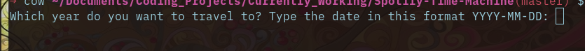

<h1 align='center'>🎶 Spotify Time Machine</h1>

<h4 align='center'>A bot that will make a top 100 song playlist for you based on any given year!</h4>

<br>


- [Live](youtube video) demonstration video.


<!-- ABOUT THE PROJECT -->
## About The Project

I was just feeling a litle nostalgic today and wanted to listen to the top 100 songs of 2010. Cause you know, those were the golden years...

Anyway, I was looking through the top 100 songs but I didn't want to manually create a playlist because that would take forever. So I decided to make a bot to do that for me!

### Built With

Python3

Packages:
- spotipy
- beautiful soup
- requests

<!-- GETTING STARTED -->
## Getting Started

The following instructions will help you get set up locally. Don't hesitate to message me if you have any problems!

### Prerequisites

- [python 3](https://www.python.org/downloads/)
- The [python installer package installer](https://pip.pypa.io/en/stable/installation/): `pip` (used to install required dependencies)
```sh
python -m ensurepip --upgrade
```

### Installation

1. Clone the repo
```sh
git clone https://github.com/dave-cao/Spotify-Time-Machine.git
```
3. Install pip packages
```sh
pip install -r requirements.txt
```

<!-- USAGE EXAMPLES -->
## Usage

1. The first thing you need to do is grab your spotify client id, client secret, and a redirect uri. Login to your spotify account at the [developers dashboard](https://developer.spotify.com/dashboard/login)
2. Once you log in, click `create an app` on the top right.


3. Once you put in the necessary information, you should now be at the application page. There should be a `Client ID` and `SHOW CLIENT SECRET`. Grab those two.

4. Now go to `edit settings` and under `Redirect URIs` add in `http://example.com`.

5. Perfect, now in the Spotify-Time-Machine directory make a `.env` file. Inside it, put in the following details:
```
SPOTIFY_CLIENT_ID=YOUR CLIENT ID
SPOTIFY_CLIENT_SECRET=YOUr CLIENT SECRET
SPOTIFY_REDIRECT_URI=http://example.com

# replace client_id and client_secret with what you got from the spotify app
```

6. Run the application
```sh
python3 main.py
```

7. If it's your first time running the app, a browser will automatically open and the bot will ask you to input the url of the page that opened. Copy and paste the page url.

8. Now, you should be met with this prompt:


3. Input the desired date you want to make a playlist from...and voila! Let the bot do it's magic. On the other hand, if you don't have a specific date in mind, then don't input anything and a random date will be chosen for you.

4. Exit application
```
ctl + c
```

_For a more comprehensive example of using this application, refer to this [video](example video here)_


<!-- ROADMAP -->
## Roadmap

There is no future plans for this application. However I do realize that there are many different playlists that you can automatically make with this API so if you have any future requests / ideas, let me know!


<!-- CONTRIBUTING -->
## Contributing

Contributions are what make the open source community such an amazing place to learn, inspire, and create. Any contributions you make are **greatly appreciated**.

If you have a suggestion that would make this better, please fork the repo and create a pull request. You can also simply open an issue with the tag "enhancement".
Don't forget to give the project a star! Thanks again!

1. Fork the Project
2. Create your Feature Branch (`git checkout -b feature/AmazingFeature`)
3. Commit your Changes (`git commit -m 'Add some AmazingFeature'`)
4. Push to the Branch (`git push origin feature/AmazingFeature`)
5. Open a Pull Request


<!-- CONTACT -->
## Contact

#### David Cao
- Email: sirdavidcao@gmail.com
- [Youtube](https://www.youtube.com/channel/UCEnBPbnNnqhQIIhW1uLXrLA)
- [Linkedin](https://www.linkedin.com/in/david-cao99/)
- Personal Website: https://davidcao.xyz/
- Project Link - https://github.com/dave-cao/Spotify-Time-Machine


